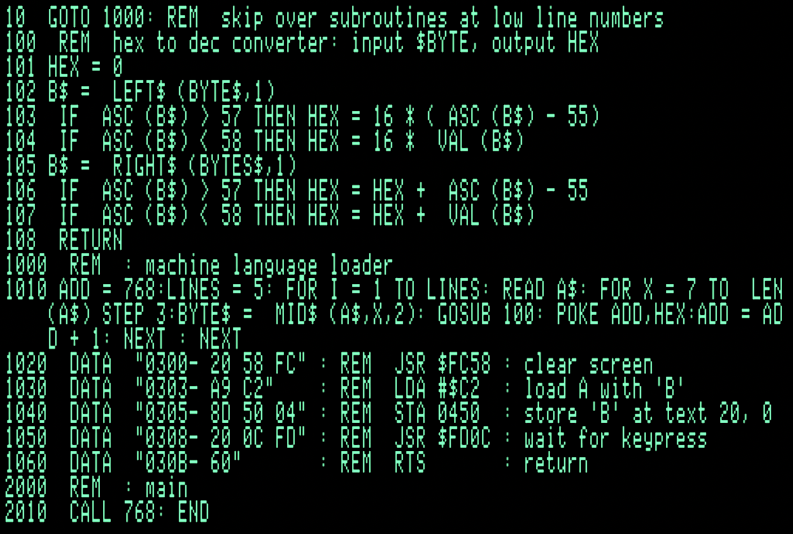
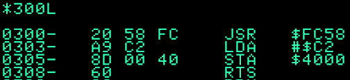

Applesoft Assembly Annotation
=============================

The Mini-Assembler doesn't allow comments. Here's my unusual way of combining
Applesoft and Assembly that allows annotation.

+ Best in 80-column mode
+ DATA string and REM mimic Monitor output
+ Comments follow
+ FOR loop reads DATA and POKEs
+ There is a hex to dec converter subroutine at 100

```
10 GOTO 1000 : REM skip over subroutines at low line numbers

100 REM hex to dec converter: input $BYTE, output HEX
101 HEX = 0
102 B$ = LEFT$(BYTE$, 1)
103 IF ASC(B$) > 57 THEN HEX = 16 * (ASC(B$) - 55)
104 IF ASC(B$) < 58 THEN HEX = 16 * VAL(B$)
105 B$ = RIGHT$(BYTES$, 1)
106 IF ASC(B$) > 57 THEN HEX = HEX + ASC(B$) - 55
107 IF ASC(B$) < 58 THEN HEX = HEX + VAL(B$)
108 RETURN

1000 REM : machine language loader
1010 ADD = 768 : LINES = 5 : FOR I = 1 TO LINES : READ A$ : FOR X = 7 TO LEN(A$) STEP 3 : BYTE$ = MID$(A$,X,2) : GOSUB 100 : POKE ADD, HEX : ADD = ADD + 1 : NEXT : NEXT
1020 DATA "0300- 20 58 FC" : REM JSR $FC58 : clear screen
1030 DATA "0303- A9 C2"    : REM LDA #$C2  : load A with 'B'
1040 DATA "0305- 8D 50 04" : REM STA 0450  : store 'B' at some location
1050 DATA "0308- 20 0C FD" : REM JSR $FD0C : wait for keypress
1060 DATA "030B- 60"       : REM RTS       : return

2000 REM : main
2010 CALL 768 : END
```


